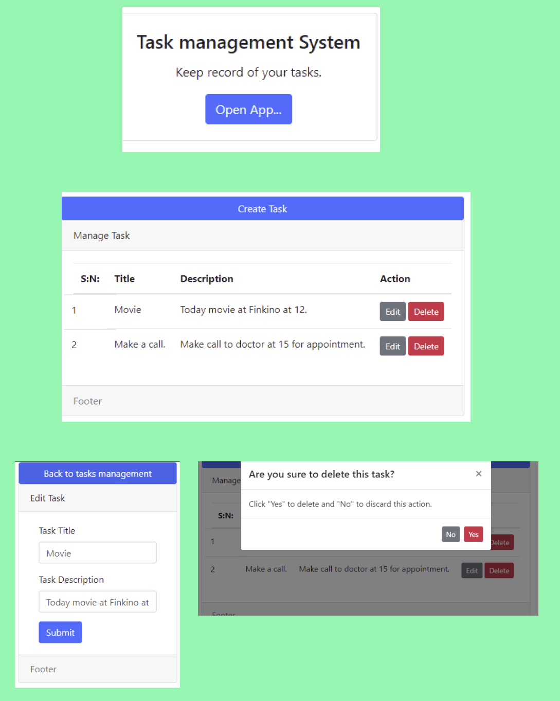

## Task Management App using 

- The app is using Laravel 8

### Purpose of project.
- Learning Laravel

### features of app
- CRUD (CREATE, READ, UPDATE and DELETE operation)
- Simple app where to create task which shows title and description.
- The task can edit and delete.

## Bootstrap Auth in Laravel

install 
```code
install 
composer require laravel/ui
php artisan ui bootstrap --auth
npm install
npm run dev
```

laravel-notify 
```code
$ composer require mckenziearts/laravel-notify
```
add service provider to config/app.php

```code
'providers' => [
    ...
    Mckenziearts\Notify\LaravelNotifyServiceProvider::class
    ...
];
```
Publish the configuration file and assets by running:
```code
$ php artisan vendor:publish --provider="Mckenziearts\Notify\LaravelNotifyServiceProvider"
```
Now that we have published a few new files to our application we need to reload them with the following command:
```code
$ composer dump-autoload
```
- Add styles links with @notifyCss
- Add scripts links with @notifyJs
- use notify() helper function inside your controller to set a toast notification for info, success, warning or error
- Include notify partial to your master layout @include('notify::components.notify')
## If you are on Laravel 7 or greater, you can use the tag syntax.
```code
<x:notify-messages />
@include('notify::components.notify')
```
where ever you need notification you can use this :
notify()->success('Laravel Notify is awesome!')

### Laravel HTML to PDF converter
Require this package in your composer.json and update composer.
 install package
 ```code
composer require barryvdh/laravel-dompdf
```
After installation add the following lines to register provider config/app.php
```code
$app->register(\Barryvdh\DomPDF\ServiceProvider::class);
```
into aliases config/app.php
```code
'PDF' => \Barryvdh\DomPDF\Facade::class,
```
Vendor publish by runing this comand in terminal this will create dompdf.php inside config. You can change some default setting
```code
 php artisan vendor:publish --provider="Barryvdh\DomPDF\ServiceProvider"
```
In route specify controller and function
```code
Route::get('/task/generate/pdf', 'App\Http\Controllers\TaskController@createpdf')->name('createpdf');
```
lastly in controller call in header *use PDF*  and make public function createpdf(){}
```code
use Barryvdh\DomPDF\Facade\Pdf;

public function createpdf() {
        
        $task = new Task();
        $task = $task->all();
        $pdf = PDF::loadView('tasks.generatepdf',['task' => $task]); 
        
    
        return $pdf->download('tasks.pdf');
    }
```


